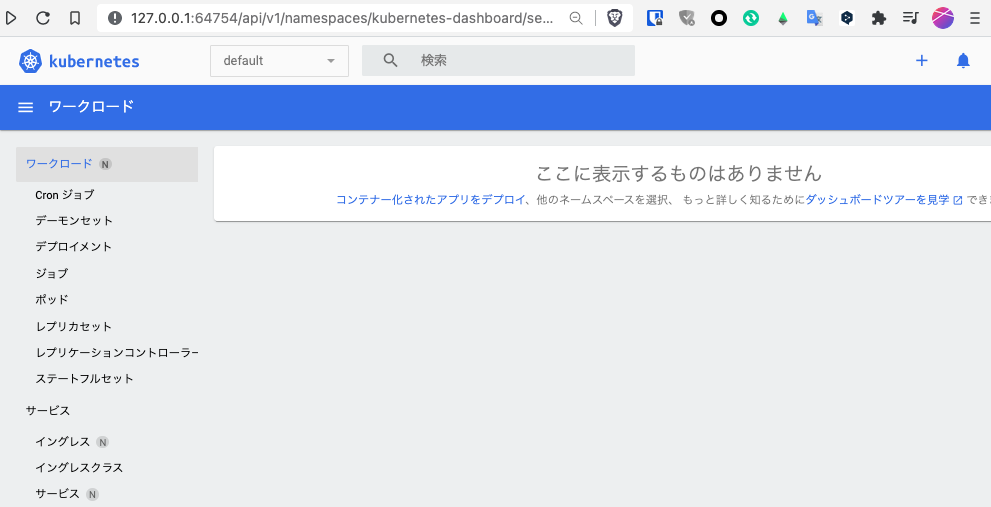

# ダッシュボードGUI

K8sは動作すると基本的にバックグラウンドで動作するため、その状態を取得する方法は最初のうちは辛いかと思います。
逆に慣れてくると俯瞰して眺めたいときなどにGUIが欲しくなることもあります。
そこで標準でダッシュボードが用意されているのですが、呼び出し方がちょっと難しかったりします。

今回`minikube`を用いてるのもポイントで、ダッシュボード呼び出しが楽にできます。
一度起動すると、停止するまで端末が使えなくなってしまうため、別の端末を開いて、そこで行ってみましょう。

```{code-block} ps1
:caption: ダッシュボードの起動(minikube startしていることが前提)
PS> minikube dashboard
```

起動にしばらく(〜1分ぐらい?)待たされるかもしれませんが、準備できればブラウザが開きます。



ダッシュボードが見られるのは、コマンドラインでダッシュボードの指示を出している間だけです。
停止すると使えなくなります。

