# 初めてのデプロイメント、そして(簡易)公開

では、ダッシュボードを使って初めての**デプロイメント**を実行してみましょう。
デプロイメント(deployment)は、指定したイメージを使ってコンテナをクラスタ内で保持する仕組みです。

## Webサーバーのデプロイメント

Webサーバーとして、Docker Hubにあるhttpdイメージを使ってWebサーバーを展開してみます。
ここでは感覚をつかむため、ダッシュボードでやってみましょう。

ダッシュボード右上のプラス(`+`)ボタンから始めます。

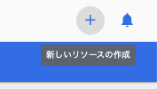

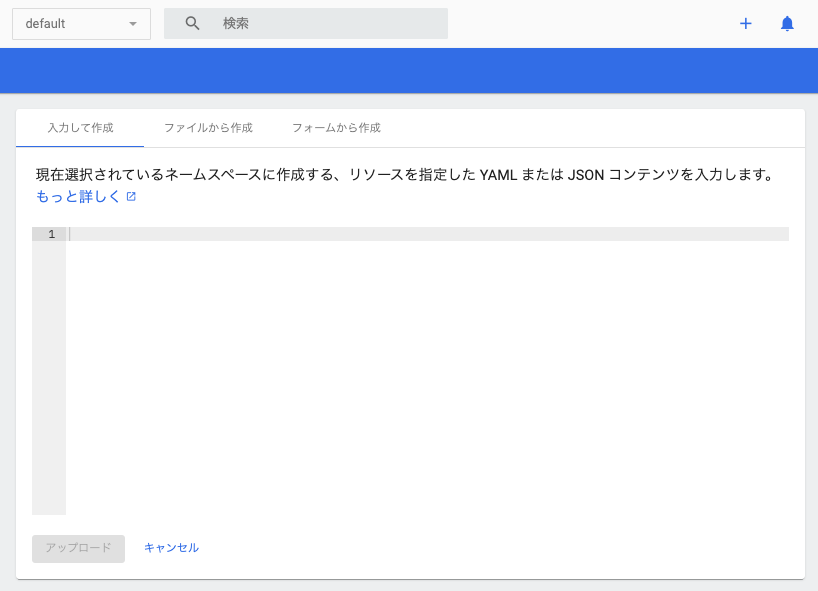

「フォームから作成」に切り替え、必要項目を埋めていきます。

* アプリ名: apache
* コンテナーイメージ: httpd:2.4-alpine
    * 軽いから、というだけです
* ポッド数: 1(そのまま)
* サービス: External(外部に公開したい)
    * ポート: 8888
        * 空きポート番号であれば適当に使えますが、ここではこの番号にしておきます
    * ターゲットポート: 80
    * プロトコル:TCP
    * 自動的に次の追加の行が出ますが放置してください
* ネームスペース: default(そのまま)

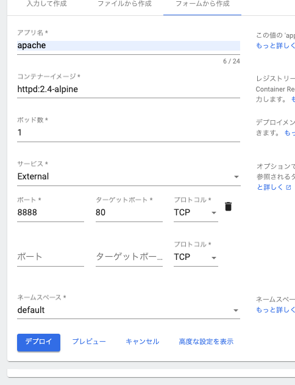

入力後「プレビュー」すると、YAMLもしくはJSONでのテキストが確認できます。

```yaml
apiVersion: apps/v1
kind: Deployment
metadata:
  name: apache
  namespace: default
  labels:
    k8s-app: apache
spec:
  replicas: 1
  selector:
    matchLabels:
      k8s-app: apache
  template:
    metadata:
      name: apache
      labels:
        k8s-app: apache
    spec:
      containers:
        - name: apache
          image: httpd:2.4-alpine
          securityContext:
            privileged: false
```

これがなんなのかについては今後の話となりますが、 **マニフェスト**(manifest)というものになります。
一旦「閉じる」ボタンを押してから「デプロイ」を実行します。

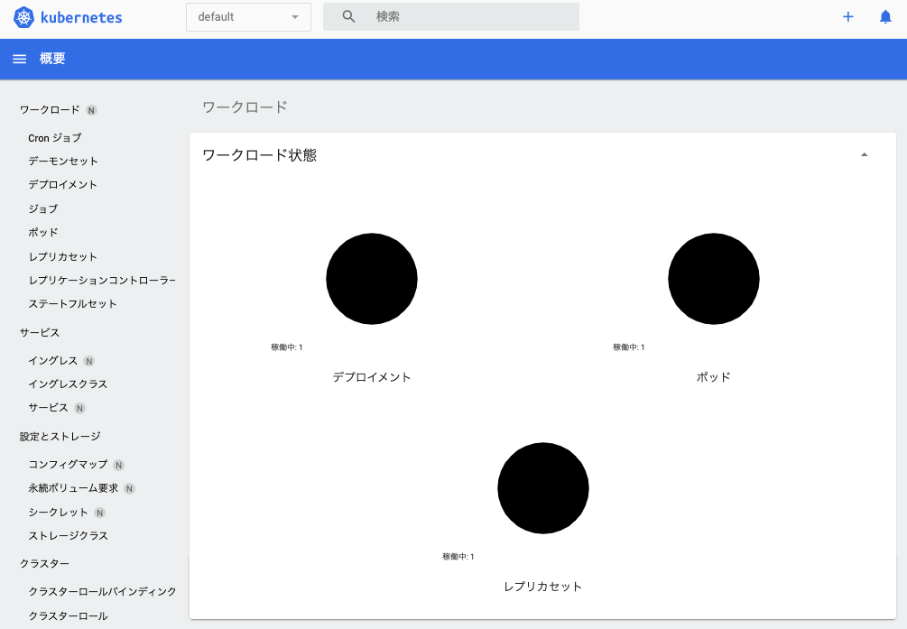

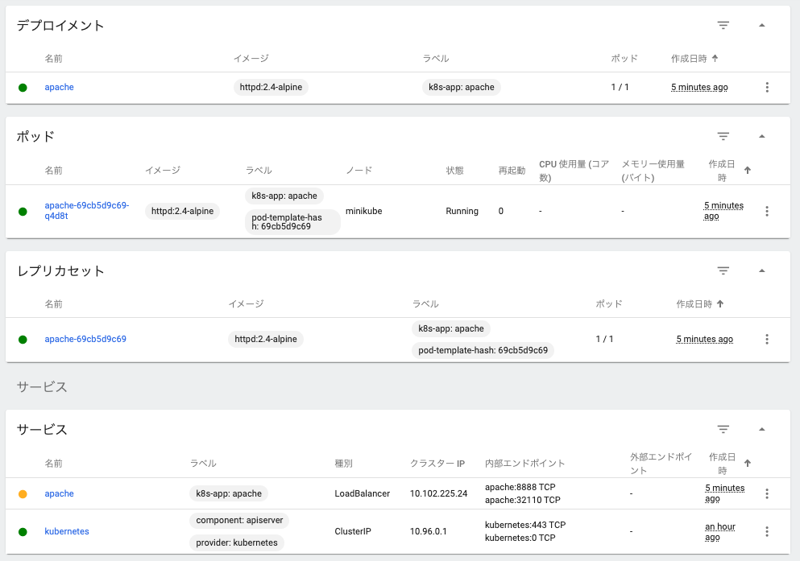

「サービス」部のapacheがまだ黄色ですね、これは要注意(pending)であることを示しています。
このままではまだ利用できません。本来ならIngressというサービス(ここは今はわからなくて良いです)で繋ぐなど面倒なことをしないといけないので、Ingress代わりの補助システムを立ち上げてサポートさせます。

```powershell
# 端末をもう一月どうしてください
PS> minikube tunnel
```

これでグリーンになるはずです。

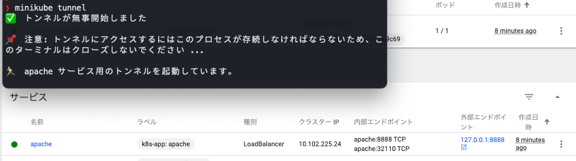

これで http://localhost:8888/ に繋ぐとhttpdイメージにおける初期ページ(It's works)に繋がるはずです。

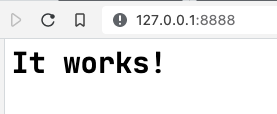

## デプロイメントの解除(削除)

続いて今のデプロイメントを解除して、httpdベースのコンテナの挙動を止めておきましょう。
ワークロードの表示であることを確認し、「デプロイメント」のapacheのボタンから「削除」を選びます、確認も出るので「削除」をクリックします。
すると、「ポッド」「レプリカセット」の各項目も追って消えていきます。

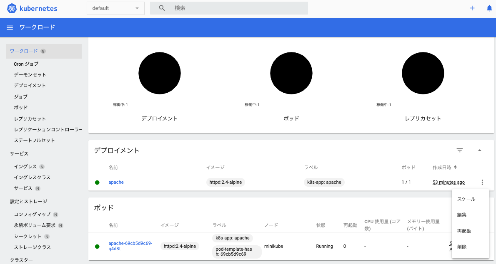

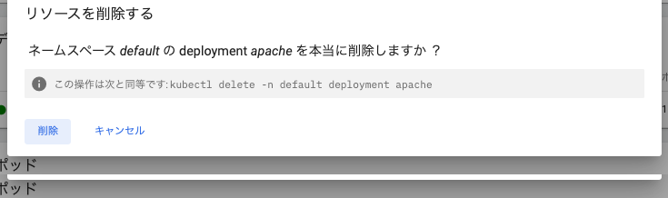

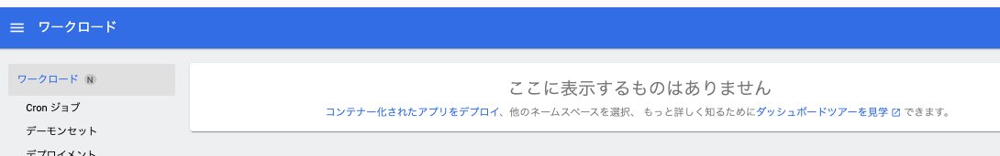

なお、「サービス」に切り替えるとapacheの項目が残っていると思います。こちらも同様に削除しておいてください。

※ 間違って **"kubeernetes" サービスを止めない**ように注意してください。

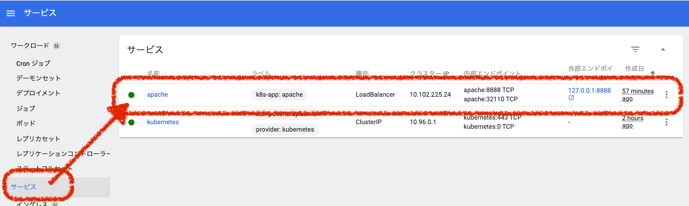

※ 間違って "kubeernetes" サービスは止めないように注意してください。


