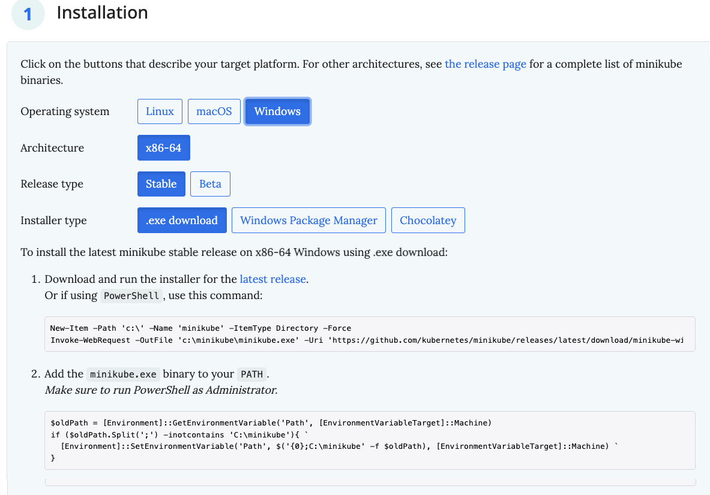

# とりあえずminikubeを入れよう

まずは今回のK8s環境の基本構造を作るため、 `minikube` を導入しましょう。
`minikube` は、K8s環境を手持ちのリソース(仮想マシンやコンテナ環境)を用いて、練習・開発用のK8sクラスタを構築・破棄できるツールとなっています。
お手軽に使えるので、基本的な話に入る前に準備だけしておきます。

## (Windows)Wingetを使ってインストールする

Wingetが使えるなら、すごく簡単です。管理者のPowerShellを開き、

```powershell
PS> winget install -e --id Kubernetes.minikube
```

で終わりです。一度端末を閉じ、通常のユーザーで開き直したら、インストールされた `minikube` のバージョンを出してチェックしておきます。

```powershell
PS> minikube version
minikube version: v1.26.1
commit: 62e108c3dfdec8029a890ad6d8ef96b6461426dc
```

※ この確認方法は他のやり方でも同様に行えるため、以下は省略します。

## (macOS)homebrewを用いる場合

macOSを使う人は普通[homebrew](https://brew.sh/index_ja)入れているはずなので、いつも通りに行えるはずです。

```zsh
% brew install minikube
```

## 手動で入れたい場合

手動でのインストールであれば、 `minikube` の本家サイトから行く必要があります。

* [Welcome! | minikube](https://minikube.sigs.k8s.io/docs/)
    * [Get Started!](https://minikube.sigs.k8s.io/docs/start/)

**Installation** にて、OS(Windows)、Archietecture(x86-64)、Release Type(Stable)、Installer Type(.exe download)を選択し、指示されたとおりにPowerShellを開いて操作していってください。

* ダウンロードの部分は通常ユーザーで行えばOK
* PATH変数設定の部分は **管理者のPowerShell** にて行えばOK

となっています(英文をきちんと読みましょう)。



