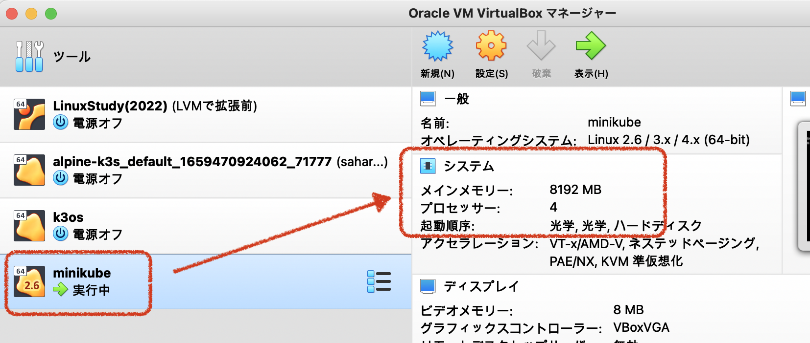

# クラスターの構築・削除

今後の授業開始時には、minikubeによるK8sクラスターが必須となります。
ここではクラスターの作成と削除についてまとめておきます。

## クラスターの作成

minikubeが入ったら、 **クラスター(cluster)** を作ります。
クラスターは、「K8sを走らせる **ノード(node)** の集合+α」 と考えてください。
クラスターには、実際に作業するコンテナなどを走らせるためのワーカーと、それを制御するコントローラーが必要ですが、
minikubeはこれらの基本環境を手持ちのリソースの中から適当に選んで最小限の環境を構築します。

手順はとても簡単で、

```powershell
PS> minikube start
```

とするだけです。これで環境を自動検出して構築を開始します。
以下の実行例は、macOSでの実行例となります。初めて実行するときなどは、必要なイメージのダウンロードのため時間が少しかかります。
なので、先に環境構築から始めている次第です。

```zsh
% minikube start
😄  Darwin 12.5 上の minikube v1.26.1
✨  docker ドライバーが自動的に選択されました。他の選択肢: hyperkit, virtualbox, ssh
📌  root 権限を持つ Docker Desktop ドライバーを使用
👍  minikube クラスター中のコントロールプレーンの minikube ノードを起動しています
🚜  ベースイメージを取得しています...
🔥  docker container (CPUs=2, Memory=3886MB) を作成しています...
🐳  Docker 20.10.17 で Kubernetes v1.24.3 を準備しています...
    ▪ 証明書と鍵を作成しています...
    ▪ コントロールプレーンを起動しています...
    ▪ RBAC のルールを設定中です...
🔎  Kubernetes コンポーネントを検証しています...
    ▪ gcr.io/k8s-minikube/storage-provisioner:v5 イメージを使用しています
🌟  有効なアドオン: default-storageclass
🏄  終了しました！kubectl がデフォルトで「minikube」クラスターと「default」ネームスペースを使用するよう設定されました
```

```zsh
% minikube status # 稼働状況の確認
minikube
type: Control Plane
host: Running
kubelet: Running
apiserver: Running
kubeconfig: Configured
```

動いていないときはこんな感じです。

```zsh
# minikube環境を構築したけど停止しているとき
% minikube status
minikube
type: Control Plane
host: Stopped      # 停止状態
kubelet: Stopped
apiserver: Stopped
kubeconfig: Stopped
```

```zsh
# 構築すらしていない場合
% minikube status
🤷  「minikube」プロファイルが見つかりません。全プロファイルを表示するために「minikube profile list」を実行してください。
👉  クラスターを起動するためには、「minikube start」を実行します
```

### おまけ: ノードのカスタマイズ

起動するノードについては、カスタマイズ可能です。
CPUとメモリはそれぞれ初回start(クラスタ作成)の際に `--memory` と `--cpus` で渡せます。
ただし、利用するドライバと実行環境により能力を飛び越える設定は失敗することになります。

```zsh
# 8192MB(8G), 4cpus
% minikube start --memory=8g --cpus=4 ※失敗
😄  Darwin 12.5 上の minikube v1.26.1
✨  docker ドライバーが自動的に選択されました。他の選択肢: hyperkit, virtualbox, ssh
- docker デーモンが十分な CPU/メモリーリソースを利用できることを確認してください。
- ドキュメント https://docs.docker.com/docker-for-mac/#resources
```

Docker Desktopの設定でCPUとメモリの上限が設定されているため、それを超えた設定がキャンセルされた状態です。
ということで、デフォルトでは、Dockerが入っている場合はそれを用いるため、Dockerの動作環境に依存することになります。

その他の実行環境を選べば余地はあります。例えばVirtualBoxが入っていれば、それを用いて構築することも可能です。

```zsh
# 8192MB(8G), 4cpus on VirtualBox
minikube start --memory=8g --cpus=4 --driver=virtualbox
😄  Darwin 12.5 上の minikube v1.26.1
✨  ユーザーの設定に基づいて virtualbox ドライバーを使用します
👍  minikube クラスター中のコントロールプレーンの minikube ノードを起動しています
🔥  virtualbox VM (CPUs=4, Memory=8192MB, Disk=20000MB) を作成しています...
🐳  Docker 20.10.17 で Kubernetes v1.24.3 を準備しています...
    ▪ 証明書と鍵を作成しています...
    ▪ コントロールプレーンを起動しています...
    ▪ RBAC のルールを設定中です...
    ▪ gcr.io/k8s-minikube/storage-provisioner:v5 イメージを使用しています
╭──────────────────────────────────────────────────────────────────────────────────────────────────────────────────────╮
│                                                                                                                      │
│    「virtualbox」ドライバーが選択されましたが、より良い選択肢があります！                                            │
│    性能と機能の向上のため、別のドライバー使用を検討してください:                                                     │
│            - hyperkit                                                                                                │
│                                                                                                                      │
│    この警告を表示させないためには、以下を実行してください:                                                           │
│                                                                                                                      │
│            $ minikube config set WantVirtualBoxDriverWarning false                                                   │
│                                                                                                                      │
│                                                                                                                      │
│    minikube ドライバーについてもっと知るためには、https://minikube.sigs.k8s.io/docs/drivers/ を確認してください。    │
│    ベンチマークについては https://minikube.sigs.k8s.io/docs/benchmarks/cpuusage/ を確認してください                  │
│                                                                                                                      │
╰──────────────────────────────────────────────────────────────────────────────────────────────────────────────────────╯
🔎  Kubernetes コンポーネントを検証しています...
🌟  有効なアドオン: default-storageclass, storage-provisioner
🏄  終了しました！kubectl がデフォルトで「minikube」クラスターと「default」ネームスペースを使用するよう設定されました
```

VirtualBoxのマネージャーを使うと実際にVMが動いていることも確認できます。



途中で指摘されているように、よりよい環境としては、Hyper-V(Windows10/11 pro)やhyperkit(macOS)の利用が推奨されています。
Docker以外で行うときは、利用可能であれば使ってみることも検討してみてください。

なお、授業内で行う内容であれば、 **基本的にデフォルトのリソース(CPU、メモリ)で十分です** 。

## クラスターの削除

不要になったり、完全にやり直したい場合も、クラスターはさくっと消せます。

```powershell
# クラスタ起動中でもOK
PS> minikube delete
🔥  virtualbox の「minikube」を削除しています...
💀  クラスター「minikube」の全てのトレースを削除しました。
```
