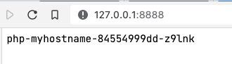
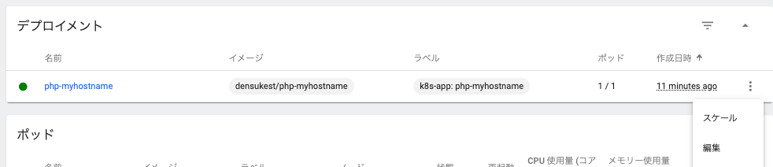
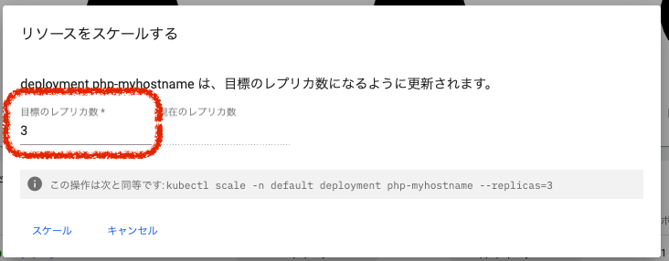
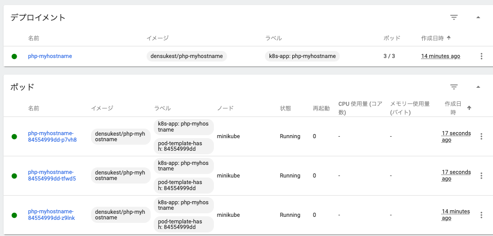
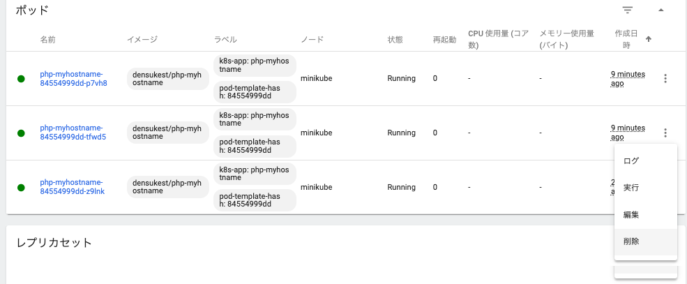
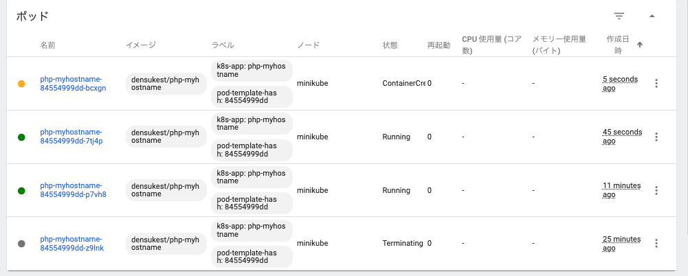

# レプリケーションとオートヒーリング

K8sを使うメリットのひとつとして、レプリケーションのサポートとオートヒーリングの機能が入ってきます。
ここではそれを体験してみましょう。

## ホスト名を見るサービスを構成してみる

今回の練習用に、イメージ `densukest/php-myhostname` というイメージを用意しました。
これを「最初のデプロイメント」と同様に配置してみます。

* アプリ名: php-myhostname
* コンテナーイメージ: densukest/php-myhostname
* ポッド数: 1
* サービス: External
    * ポート: 8888(任意番号)
    * ターゲットポート: 80
    * プロトコル: TCP
* ネームスペース: default(そのまま)

しばらくすると青くなるので、トンネルも開いてアクセス可能にしておきましょう。

```powershell
# すでに起動しているものがあれば不要です
PS> minikube tunnel
```

「サービス」部分のphp-myhostnameが青になって、「外部エンドポイント」が提示されたらアクセスしてみましょう。
なお、ブラウザキャッシュの都合で "It's works!" がでてしまうこともあるので、リロードしてみてください。



## レプリケーション

では、この状態に対して、レプリケーションを実行します。実際にはスケーリング(scaling)が正しいですが気にしないでください。
ダッシュボードの「ワークロード」にて、デプロイメントphp-myhostnameで「スケール」を呼び出し…



目標レプリカ数を3に設定してスケールを実行してみてください。



少し待つと、ポッドの項目が増えます。



全てのポッド部分が青くなったことを確認したら、ブラウザを切り替えて、ホスト名のものにしてください。
リロードを少し間(1,2秒)を開けながら繰り返してみてください。時折ホスト名の出力が変わると思います。

つまり、同内容のコンテナで構成された3つのホストが、タイミングに応じて適当に呼び出されています。これはいわゆる**ロードバランサー**というものが途中でリクエストを切り替えているのです。なお、本当に1/3になってるかは微妙です。

ちょっと試してみました。

```zsh
% for i in {1..100}; do curl -s 127.0.0.1:8888; echo; sleep 0.1; done | tee /tmp/result
php-myhostname-84554999dd-tfwd5
php-myhostname-84554999dd-z9lnk
php-myhostname-84554999dd-z9lnk
php-myhostname-84554999dd-tfwd5
...
% sort /tmp/result | uniq -c
  28 php-myhostname-84554999dd-p7vh8
  33 php-myhostname-84554999dd-tfwd5
  39 php-myhostname-84554999dd-z9lnk
```

完全にとはいっていませんが分散していますね。

```{hint}
逆にスケーリングを0に設定すると、動いているポッドがなくなります。
デプロイメント(とレプリカセット)は残るので、リソースを削除せずにほぼ無害な状態にできるということになります。
一時的に実消費量を抑えるという目的で使うことはあったりします。
```


## オートヒーリング

サービス継続のためには、レプリケーションにより同内容のコンテナが稼働して、それらが入れ替わっていく必要があります。
でも中には何らかの理由でコンテナがコケることはあります。
そういう時適切な設定をしているのであれば、他のコンテナに作業を引き継いでもらうことも可能でしょう。

コケたコンテナが発生すると、そのコンテナだけ終了してしまうことになるため、3→2という具合に対応できるコンテナが減ることになります。
しかし、先ほどのスケールで設定した値は「目標の」とついていました。

```{figure} images/replica-3-config.png
---
width: 75%
---

スケールの呼び出し(再掲)
```


実はこの設定は「3つにする」ではなく「3つ起動した状態を目標とする」なため、途中でコンテナ数が減った場合にはそれを目標に近づけようとします。
試しに、コンテナ(ポッド)をひとつ手動で殺してみましょう。



すると、数秒後には次のポッドが起動して、3つに戻ろうとします。



そのうち新しいポッドが稼働状態となり、終了したポッド(黒くなっていた)が破棄されます。
このように、仮に落ちても、設定したポッド(≒コンテナ)の数を目標としてその数を維持しようとします。

※ なお、恒常的に落ちるようではプログラム的な問題があるわけで、そこを解消する必要があります。解消したら新しいバージョンでデプロイメントを更新すると、順次ポッドが入れ替わっていくように更新されていきます(ローリングアップデート)。

こうやって、K8sは、コンテナを使ってサービスを維持していく基盤として使われるようになっています。

## デプロイメントの「再起動」

デプロイメントに対して行える操作(ダッシュボード上の3点ボタンから)として「再起動」というものがあります。
この再起動は、デプロイメントで管理下に置かれているポッド達に対して再起動が促されます。
指定することで(確認が出た後で)、各ポッドが入れ替わります。

実際に試してみましょう。

1. わかりやすくするため、スケーリングを行い、ポッド数を3〜4程度にしておいてください
2. 再起動を選択してください

一時的にデプロイメントとレプリカセットは白丸になりますが、ポッド部分をみると、一時的に増加している様子が見えると思います。
そのうち落ち着いて、指定数になれば各丸は緑に戻るでしょう。

## 後始末

では、この練習環境もそろそろ終わりにしたいと思います。

* デプロイメントにてうごいているものを削除し、ポッド達が順次消えていくのを確認してください(少し時間がかかるかもしれません)
* サービスも確認し、削除しておきましょう(kubernetesは削除しないこと!)
* トンネル機能も使いませんので、 `minikube tunnel` している端末でCtrl-Cしておいてください
* 同様にダッシュボードも止めておきましょう
